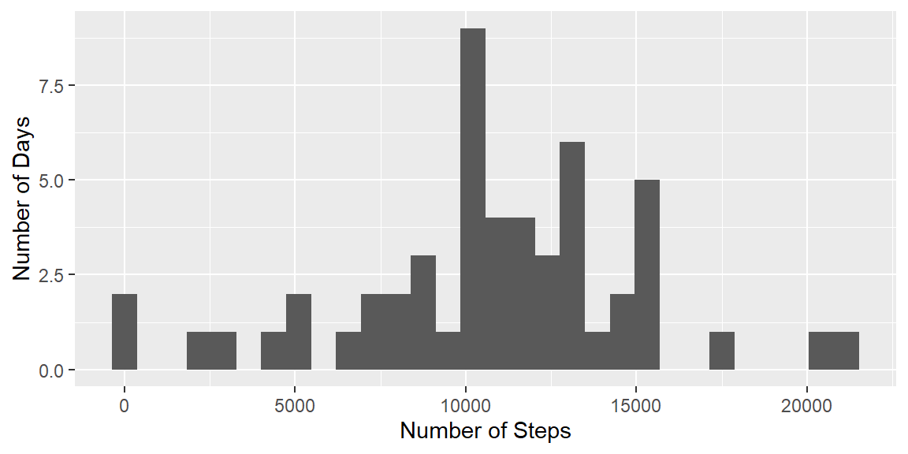
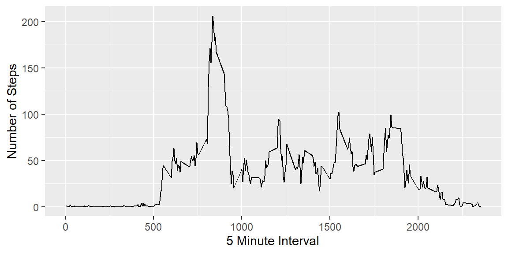
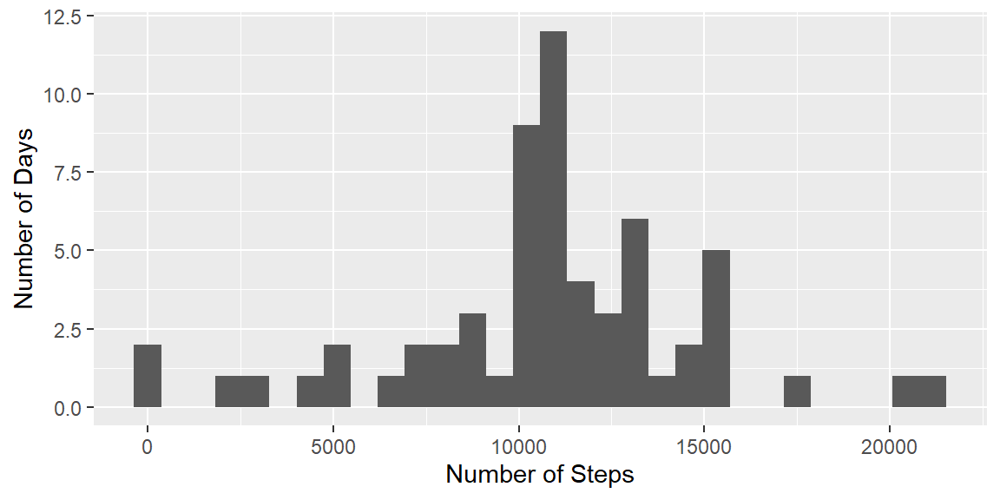
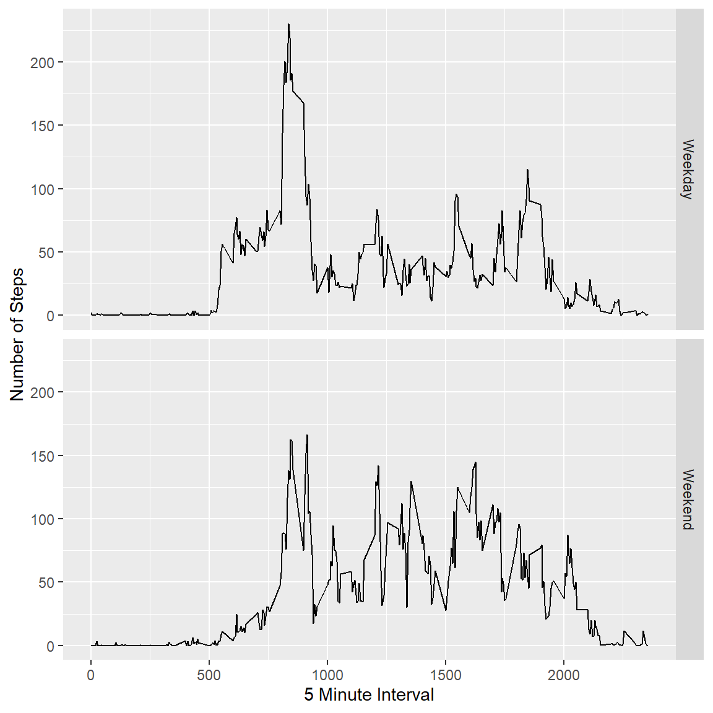

## Loading and processing data

First we read in the data from csv.


```r
data <- read.csv("activity.csv")
```

Then convert the "date" column to date format.


```r
data$date <- as.Date(data$date, format="%Y-%m-%d")
```

And create a copy of the data with NA values removed.


```r
data_rmna <- data[!is.na(data$steps),]
```


## Calculating mean number of steps taken per day

Calculate the total number of steps taken each day (group and summarise the data by date).


```r
library(dplyr)
library(tidyr)
data_rmna_date <- data_rmna %>%
  group_by(date) %>%
  summarise(steps=sum(steps))
```

Plot a histogram of the number of steps taken each day.


```r
library(ggplot2)
ggplot(data_rmna_date, aes(x=steps)) +
  geom_histogram() +
  scale_x_continuous(name="Number of Steps") +
  scale_y_continuous(name="Number of Days")
```



Calculate the mean and median number of steps per day.


```r
meandailysteps <- mean(data_rmna_date$steps)
mediandailysteps <- median(data_rmna_date$steps)
```

The mean number of steps taken per day is 10766.19 and the median is 10765.


## Plotting daily profile of activity

Create a copy of the data grouped by 5 minute interval.


```r
data_rmna_interval <- data_rmna %>%
  group_by(interval) %>%
  summarise(steps=mean(steps))
```

Plot the average profile of steps across the day.


```r
ggplot(data_rmna_interval, aes(x=interval, y=steps)) +
  geom_line() +
  scale_x_continuous(name="5 Minute Interval") +
  scale_y_continuous(name="Number of Steps")
```



Find the five minute interval with the highest average number of steps.


```r
highestaverageinterval <- data_rmna_interval$interval[data_rmna_interval$steps == max(data_rmna_interval$steps)]
```

The interval with the highest average number of steps is 835.


## Dealing with missing values

Calculate the number of missing values.

```r
nacount <- sum(is.na(data$steps))
```

There are 2304 missing values in the data.

Replace missing values with the mean for that interval.


```r
names(data_rmna_interval) <- c("interval","intervalaveragesteps")
datafilled <- merge(data, data_rmna_interval, by="interval")
datafilled$steps[is.na(datafilled$steps)] <- datafilled$intervalaveragesteps[is.na(datafilled$steps)]
datafilled <- datafilled[,c("steps","date","interval")]
```

Recalculate the mean number of steps taken each day with the filled values, and plot a new histogram of the number of steps taken each day.


```r
datafilled_date <- datafilled %>%
  group_by(date) %>%
  summarise(steps=sum(steps))

ggplot(datafilled_date, aes(x=steps)) +
  geom_histogram() +
  scale_x_continuous(name="Number of Steps") +
  scale_y_continuous(name="Number of Days")
```



```r
meandailystepsfilled <- mean(datafilled_date$steps)
mediandailystepsfilled <- median(datafilled_date$steps)
```

After filling the missing values with the average for that interval, the new mean steps per day is 10766.19 and the median is 10766. The infilling process has had minimal impact on the mean and median values.


## Exploring weekday/weekend differences

Create a new factor variable indicating whether each observation was on a weekday or weekend.


```r
datafilled$weekday <- weekdays(datafilled$date)
datafilled$daytype <- "Weekday"
datafilled$daytype[datafilled$weekday == "Saturday" | datafilled$weekday == "Sunday"] <- "Weekend"
datafilled$daytype <- as.factor(datafilled$daytype)
```

Create a panel plot showing the daily profile of steps on weekdays and weekends separately.


```r
library(gridExtra)

datafilled_interval <- datafilled %>%
  group_by(interval, daytype) %>%
  summarise(steps=mean(steps))

ggplot(datafilled_interval, aes(x=interval, y=steps)) +
  geom_line() +
  scale_x_continuous(name="5 Minute Interval") +
  scale_y_continuous(name="Number of Steps") +
  facet_grid(rows=vars(daytype))
```



The weekday activity is more concentrated in morning and evening peaks, while weekend activity is more evenly spread across the day.
